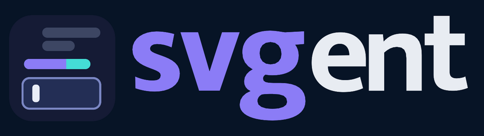
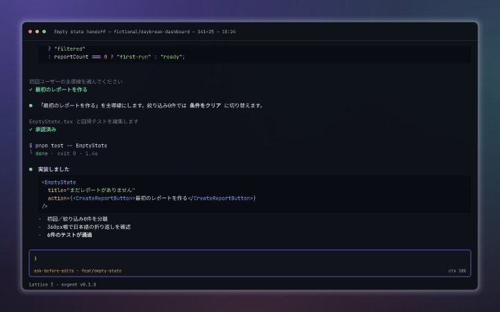
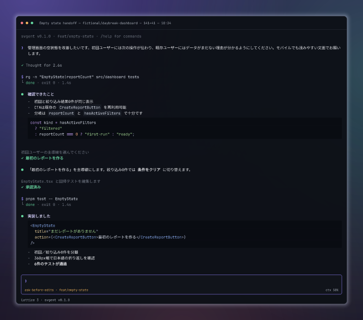
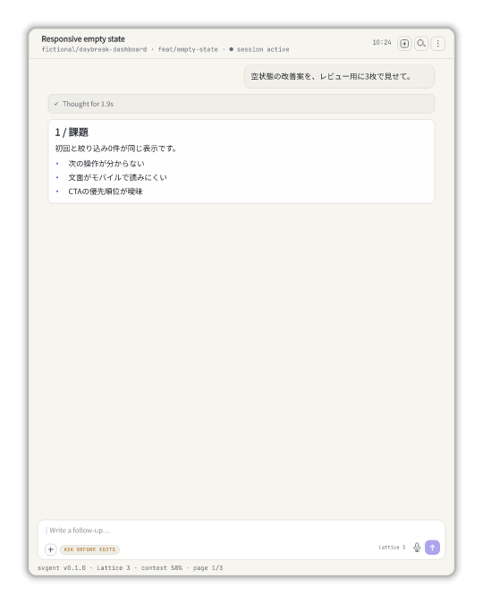
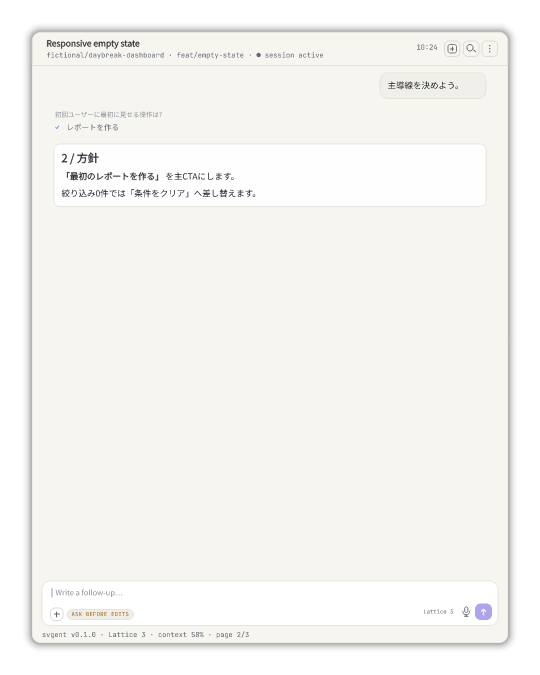
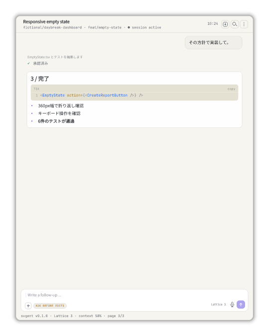

<p align="center">
  
</p>

[English](README.md) | **日本語**

# SVGENT

SVGENT は、**エージェントとの会話を創作して画像と動画に残す**ツールです。台本をアプリ / ターミナルの2種類の画面で組み立て、SVG・PNG・WebP・GIF・MP4 へ書き出します。Studio はブラウザだけで、CLI はローカルだけで動きます。

セッション画面は SVG で描かれています。文字は書き出す時点でアウトライン化されるため、開く環境に同じフォントがなくても表示は変わりません。

※ CSS セレクタ、`@keyframes` 名、`clipPath` の id はすべて固有の接頭辞付きで、`path` や `g` のような要素セレクタは使いません。埋め込みは `` か `<object>` を推奨します。HTML へインライン展開した場合は、ページ側の CSS も中の要素に適用されます。

## デモ

すべて [examples/](examples/) の台本を CLI でレンダリングしたものです。

### ターミナル — 実装の調査から承認まで

<p align="center">
  
</p>

内容: IME入力(`[[空状態|からじょうたい]]`)、日本語の折り返し、thinking、tool実行、Markdown、TypeScriptのsyntax highlight、choice、承認UI

表示形式: animated SVG (2.65 MB) · [animated WebP (1.74 MB)](assets/readme/demo/readme-tui-dark-01.animated.webp) · [MP4 (26.8秒、0.25 MB)](assets/readme/demo/readme-tui-dark-01.mp4) · [台本](examples/readme-tui-dark.json)

### アプリ — choiceから画像生成へ

<p align="center">
  
</p>

選択のあと tiles skeleton で間を取り、完成画像へ切り替わります。生成中は状態文も更新されます。

表示形式: animated SVG (1.81 MB) · [animated WebP (2.46 MB)](assets/readme/demo/readme-app-image-01.animated.webp) · [MP4 (20.4秒、0.19 MB)](assets/readme/demo/readme-app-image-01.mp4) · [台本](examples/readme-app-image.json) · [生成画像](packages/studio/assets/presets/watercolor-traveler-dusk.webp)

### ターミナル — 追従カメラで拒否から承認へ

<p align="center">
  
</p>

カメラの動きはレンダリング前に決まります。タイムラインと実際の描画位置から計算するので、プレビューと書き出しがずれません。寄るのはcomposerの下書き、各メッセージ、選択が決まる瞬間のオプション欄。`camera.style` は `sync`(イベントと同時)です。

内容: diffのsyntax highlight、方針のchoice、いったん**拒否**される承認とその後に通る承認。背景は `abyss`、ターミナルは `phosphor`

表示形式: animated SVG (1.93 MB) · [台本](examples/readme-tui-zoom.json)

### 静止画と会話全体の一枚絵

<table>
  <thead>
    <tr>
      <th width="50%">通常の最終フレーム (WebP、0.05 MB)</th>
      <th width="50%">会話全体 (PNG、0.16 MB)</th>
    </tr>
  </thead>
  <tbody>
    <tr>
      <td></td>
      <td></td>
    </tr>
  </tbody>
</table>

`transcript-png` / `transcript-svg` はviewportを外し、スクロールで隠れた冒頭を含む会話全体にキャンバスの高さを合わせます。

### Slides — ライトテーマ＋透過キャンバス

<p align="center">
  
  
  
</p>

表示形式: poster WebP 3枚 (各0.02 MB)。`pageBreakBefore` と `messagesPerPage` で1本の会話を3ページに分割。背景の余白は透過です。[台本](examples/readme-slides-light.json)

## 利用上の注意

svgent は利用者が用意した台本だけを描画し、実セッションの収集や、モデル・シェル・リポジトリへの接続は行いません。成果物に何が残るかは[利用上の注意](RESPONSIBLE-USE.ja.md)に書いてあります。

## 主な機能

- **アプリ / ターミナルの2画面** — 台本は共通で、切り替えるだけで両方書き出せます
- **書き出し** — 静止画は SVG / PNG / WebP、動画は SVG / WebP / GIF / MP4。長い会話はページに分けられます
- **間の設計** — 入力、thinking、ツール実行、承認、余韻をそれぞれ調整。メッセージ単位で上書きすれば、全体のテンポを崩さず一箇所だけ変えられます
- **Markdown** — リスト、引用、コードブロックの syntax highlight
- **見た目** — テーマ6種、背景とアクセント色の指定、文字とUIの拡大縮小、透過キャンバス
- **SVG source editor** — 生成された SVG をその場で編集して、プレビューに反映

MP4 は WebCodecs H.264 encoder を持つブラウザでのみ書き出せます。

## Agent Stage

同じ Studio を WebMCP のサイトツール付きで
[agent.svgent.zakideee.dev](https://agent.svgent.zakideee.dev/) に置いています。ブラウザのエージェント
(ChatGPT の内蔵ブラウザ、または WebMCP フラグを有効にした Chromium)が台本を読み込み、場面とカメラを指示し、
書き出します。その間、人はステージで手直しできます。読み込んだ台本の名前・パス・ホストは、既定で架空のものに
置き換えます。詳しくは [apps/webmcp/README.md](apps/webmcp/README.md) を参照してください。

## CLIレンダリング

UI を開かずに、台本 JSON から直接アーティファクトを生成できます:

```bash
pnpm render examples/logo-motion.json --out render-out --formats poster-svg,poster-png
```

対応フォーマットは poster-svg / animated-svg / poster-png / poster-webp / animated-webp / gif / mp4 / transcript-svg / transcript-png です。transcript はスクロールなしで会話全体を書き出します。animated-svg / animated-webp / gif はループ再生で書き出します。`--svg-play once` を渡すと animated-svg は 1 回再生になり、最後のフレームで止まります。MP4 にはローカルの ffmpeg が必要で、`FFMPEG_PATH` で `PATH` 上の実行ファイルを上書きできます。

### ページに置くとき

`` / `<object>` / `<iframe>` はファイルを別の文書として読み込むので、その中の定義が
周りのページへ届くことはありません。マークアップをそのまま展開する場合は違います。インライン
SVG の `<style>` は HTML 文書全体に効き、`@keyframes`・生成クラス・`<defs>` に付けた名前は
ページ上の他のすべてと共有されます。

書き出しはそれらの名前を surface とページ番号から作るので、**台本が違っても同じ surface なら
同名**になります。1 枚だけなら衝突相手がいませんが、同じ文書に並べると同名の `@keyframes` は
後に定義された方が勝ち、一方の絵がもう一方のタイミングで動きます。インラインする 1 枚ごとに
`--id-namespace` へ別の値を渡してください。

```bash
pnpm render a.json --formats animated-svg --id-namespace a
pnpm render b.json --formats animated-svg --id-namespace b
```

1 つの namespace は 1 つの描画を指すので、台本は 1 本ずつ渡してください。transcript は同じ
scene の別の成果物としてそう名乗るため、どんな namespace を選んでも同じ台本の poster とは
衝突しません。

## 開発

```bash
pnpm install
pnpm dev
pnpm build
pnpm check
```

## ライセンス

Licensed under either of

- [Apache License, Version 2.0](LICENSE-APACHE)
- [MIT License](LICENSE-MIT)

at your option.

同梱フォントは個別の条件に従います。Noto Sans JP (subset) と JetBrains Mono は SIL Open Font
License 1.1 で配布されており、ライセンス全文を `packages/assets/fonts/` に同梱しています。
