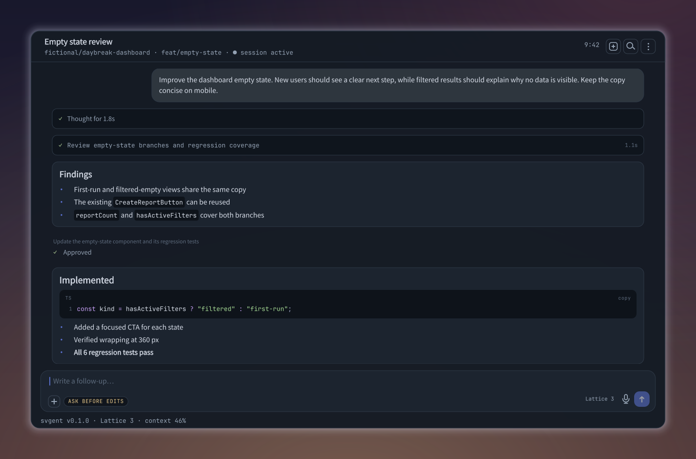
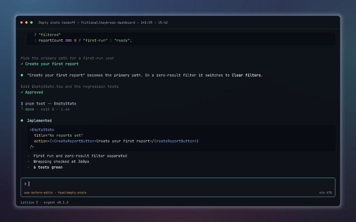
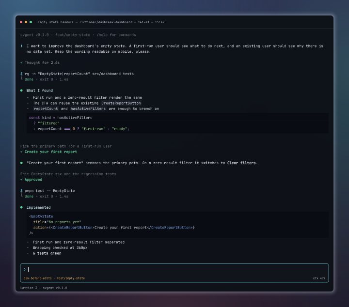
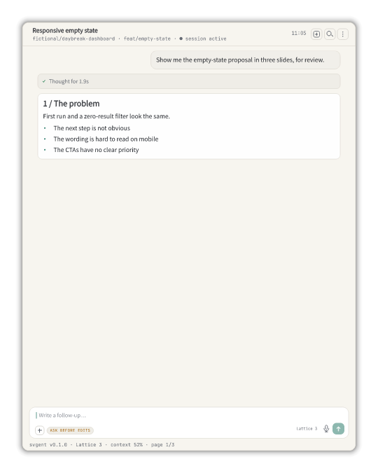
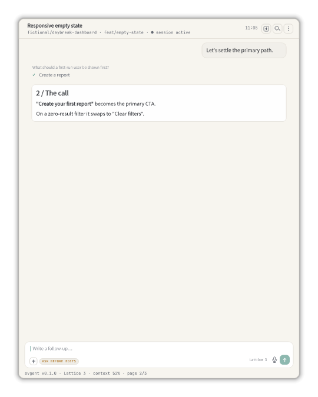
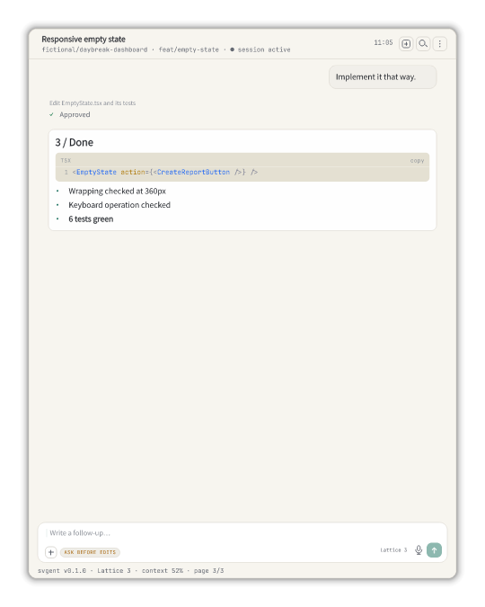

<p align="center">
  
</p>

**English** | [日本語](README.ja.md)

# SVGENT

SVGENT **composes an agent session and keeps it as images and video**. Author a script for either the App or TUI surface, then export it as SVG, PNG, WebP, GIF, or MP4. The Studio runs entirely in your browser, and the CLI entirely on your machine.

**Try it:** [svgent.zakideee.dev](https://svgent.zakideee.dev/) is the Studio. [agent.svgent.zakideee.dev](https://agent.svgent.zakideee.dev/) is the same Studio with WebMCP site tools for a browser agent.

The session screen is drawn as SVG. Text is converted to outlines at export, so the file looks the same on a machine without those fonts.

Note: selectors, `@keyframes` names, and `clipPath` ids all carry a unique prefix, and no element selectors are used. Embed with `` or `<object>`. Inline the SVG into HTML and the page's own CSS applies to what is inside it too.

## Demo

All rendered by the CLI from the scripts in [examples/](examples/). The Japanese [README.ja.md](README.ja.md) adds the demos only that language can show — IME input and Japanese line-wrapping.

### App — English review handoff

<p align="center">
  
</p>

Contents: an English request, visible progress, tool activity, an approval step, Markdown, and a TypeScript result

Displayed format: transcript SVG (0.66 MB) · [Script](examples/readme-english.json)

### TUI — From implementation research to approval

<p align="center">
  
</p>

Contents: user input, thinking, tool execution, Markdown, TypeScript syntax highlighting, a choice, and an approval UI

Displayed format: animated SVG (1.77 MB) · [Animated WebP (3.43 MB)](assets/readme/demo/readme-en-tui-dark-01.animated.webp) · [MP4 (28.4 seconds, 0.26 MB)](assets/readme/demo/readme-en-tui-dark-01.mp4) · [Script](examples/readme-en-tui-dark.json)

### App — From a choice to image generation

<p align="center">
  
</p>

Generation starts after the selection, holds on a tiles skeleton, then resolves to the finished image. The status copy updates as it goes.

Displayed format: animated SVG (1.46 MB) · [Animated WebP (5.00 MB)](assets/readme/demo/readme-en-app-image-01.animated.webp) · [MP4 (20.1 seconds, 0.18 MB)](assets/readme/demo/readme-en-app-image-01.mp4) · [Script](examples/readme-en-app-image.json) · [Generated image](packages/studio/assets/presets/watercolor-traveler-dusk.webp)

### App — A follow camera over a generated cover

<p align="center">
  
</p>

The camera is planned from the timeline and the measured geometry before rendering, so preview and every export share the same moves. Each shot frames its subject's real extent: the composer draft, the attached reference, the options block as the answer commits, and the image card. `camera.style` is `trail`, so each shot lands just after its event.

Contents: a choice answered in freeform text instead of a pick, an _Allow always_ approval, and the `sweep` generating skeleton over an `ember` window on a `peach` canvas

Displayed format: animated SVG (1.54 MB) · [Script](examples/readme-en-app-zoom.json) · [Generated image](packages/studio/assets/presets/generic-generated-result.webp)

### Still image and full transcript

<table>
  <thead>
    <tr>
      <th width="50%">Regular final frame (WebP, 0.05 MB)</th>
      <th width="50%">Full transcript (PNG, 0.16 MB)</th>
    </tr>
  </thead>
  <tbody>
    <tr>
      <td></td>
      <td></td>
    </tr>
  </tbody>
</table>

`transcript-png` and `transcript-svg` remove the viewport and size the canvas height to the entire conversation, including the beginning hidden by scrolling.

### Slides — Light theme with a transparent canvas

<p align="center">
  
  
  
</p>

Displayed format: three poster WebP files (0.02 MB each). `pageBreakBefore` and `messagesPerPage` split one conversation into three pages, and the margins around each image are transparent. [Script](examples/readme-en-slides-light.json)

## Responsible use

svgent renders only scripts you provide; it does not collect live sessions or connect to a model, shell, or repository. [Responsible use](RESPONSIBLE-USE.md) sets out what the output carries.

## Features

- **Two surfaces, App and TUI** — one script; switch the surface and export both
- **Exports** — stills as SVG, PNG, or WebP; animation as SVG, WebP, GIF, or MP4; long sessions split across pages
- **Timing you author** — set the pace of typing, thinking, tool runs, approvals, and holds, and override one message without disturbing the rest
- **Markdown** — lists, quotes, and fenced code with syntax highlighting
- **Appearance** — six themes, custom background and accent, font and chrome scaling, transparent canvas
- **SVG source editor** — edit the generated SVG and watch the preview follow

MP4 export needs a browser with a WebCodecs H.264 encoder.

## Agent Stage

The same Studio runs at [agent.svgent.zakideee.dev](https://agent.svgent.zakideee.dev/) with WebMCP
site tools. A browser agent (ChatGPT's built-in browser, or Chromium with the WebMCP flag) loads a
script, directs the scene and the camera, and exports, while you keep editing on the stage. Names,
paths, and hosts in a loaded script are fictionalized by default. See
[apps/webmcp/README.md](apps/webmcp/README.md).

## CLI rendering

Generate artifacts directly from a JSON script without opening the UI:

```bash
pnpm render examples/logo-motion.json --out render-out --formats poster-svg,poster-png
```

Supported formats are poster-svg, animated-svg, poster-png, poster-webp, animated-webp, gif, mp4, transcript-svg, and transcript-png. Transcript exports include the entire conversation without scrolling. Animated SVG, animated WebP, and GIF loop; `--svg-play once` renders the animated SVG as a single play that rests on its final frame. MP4 requires local ffmpeg; `FFMPEG_PATH` can override the executable found on `PATH`.

### Putting an SVG on a page

``, `<object>` and `<iframe>` each load the file as its own document, so
nothing it defines can reach the page around it. Expanding the markup inline is
different: an inline SVG's `<style>` applies to the whole HTML document, and the
names it gives its `@keyframes`, its generated classes and its `<defs>` are
shared with everything else on the page.

A render names those after the surface and the page number, so two renders of
different scripts on the same surface name things identically. Alone in a file
that collides with nothing; side by side in one document the last `@keyframes`
of a given name wins, and one drawing animates on the other's timing. Pass
`--id-namespace` a different value per inlined render:

```bash
pnpm render a.json --formats animated-svg --id-namespace a
pnpm render b.json --formats animated-svg --id-namespace b
```

One namespace names one render: pass one script at a time. A transcript export
is a different artifact of the same scene and says so in its own names, so it
never collides with a poster of that script whatever namespace you choose.

## Development

```bash
pnpm install
pnpm dev
pnpm build
pnpm check
```

## License

Licensed under either of

- [Apache License, Version 2.0](LICENSE-APACHE)
- [MIT License](LICENSE-MIT)

at your option.

Bundled fonts keep their own terms: Noto Sans JP (subset) and JetBrains Mono are distributed under
the SIL Open Font License 1.1, whose full text ships alongside them in `packages/assets/fonts/`.
